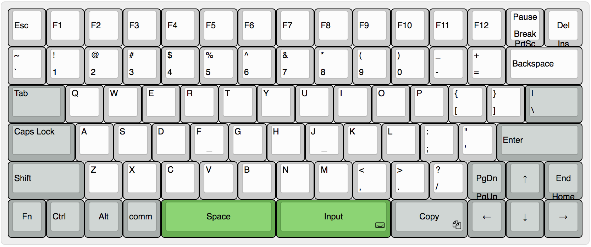
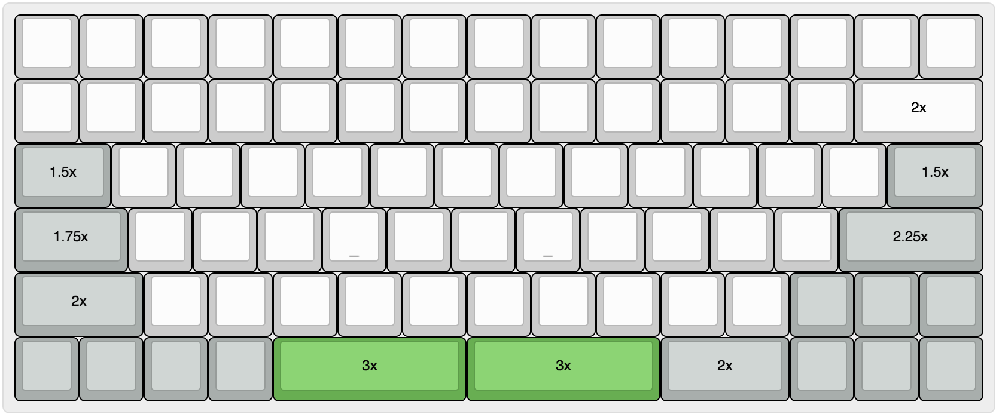

# Code80

## Layout

[Download Json](./json/keyboard-layout.json)

## Key Length

[Download Json](./json/key-length-layout.json)

## Keyboard Level Base

[Download Json](./json/layout-base.json)

## Keyboard Level 1

[Download Json](./json/layout-level1.json)

## Keyboard Level 2

[Download Json](./json/layout-level2.json)

## Keyboard Map

[Download Json](./json/keyboard-map.json)

## PCB

[Download PCB](./drawing/PCB.pcbdoc)

## Resource

- [Online keyboard editor](http://www.keyboard-layout-editor.com/)
